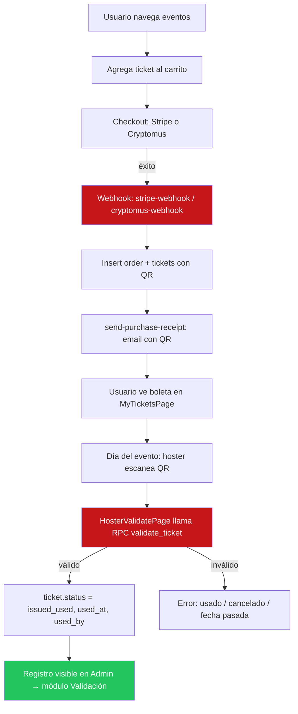
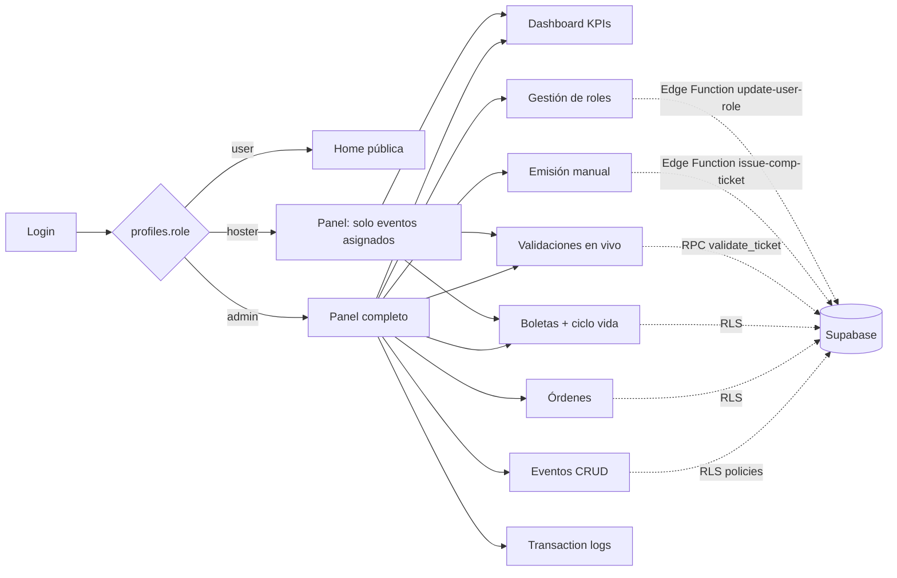
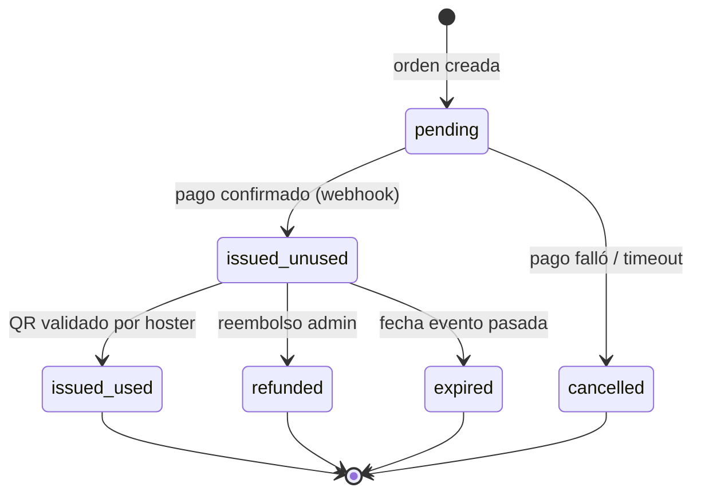

# Panel Administrativo — Arquitectura y Flujo

> Documento de diseño previo a implementación. Objetivo: alinear alcance, roles, modelo de datos y flujos antes de escribir código nuevo.

---

## 1. Contexto — qué ya existe hoy

| Pieza | Estado actual | Archivo / ubicación |
|---|---|---|
| Panel admin (shell con tabs) | **Existe** — overview, orders, tickets, logs, marketing | `src/pages/AdminDashboardPage.tsx` |
| Validación QR por hoster | **Existe** — RPC `validate_ticket` + página | `supabase/migrations/validate_ticket_function.sql`, `src/pages/HosterValidatePage.tsx` |
| Página de validación genérica | **Existe** | `src/pages/ValidateTicketPage.tsx` |
| Auth + roles (`admin`, `hoster`, `user`) | **Existe** en `profiles.role` | `migrations/001`, `013` |
| Log de transacciones Stripe | **Existe** (`transaction_logs`) | `migrations/013_admin_improvements.sql` |
| Pagos Stripe + Cryptomus | **Existe** con webhooks | `supabase/functions/*` |
| Emails (receipt, fraud, failed) | **Existe** | `supabase/functions/send-*` |
| CRUD de eventos desde admin | **NO existe** — tabla events sin UI admin | gap |
| Gestión de roles desde UI | **NO existe** — solo SQL | gap |
| Reporte de boletas por evento / vendedor | **Parcial** — hay tab tickets sin agrupar por evento | gap |
| Emisión manual de boletas (comp / cortesía) | **NO existe** | gap |
| Vista de ciclo de vida del ticket (comprado → usado → validado) | **Parcial** — status existe, no vista | gap |

---

## 2. Stack

- **Frontend**: React 19 + Vite + TypeScript, Zustand, TanStack Query, Tailwind, shadcn/radix, recharts, sonner
- **Backend**: Supabase (Postgres + Auth + Edge Functions en Deno)
- **Pagos**: Stripe Checkout + Cryptomus (cripto)
- **Hosting**: Cloudflare Pages (`wrangler.toml`)

---

## 3. Modelo de datos relevante

```
profiles (id PK → auth.users, role: admin|hoster|user, email, ...)
events (id, name, date, time, location, category, status, capacity, ...)
orders (id, order_id, buyer_id, buyer_email, total_amount, payment_status, payment_method, stripe_payment_intent_id, metadata, created_at)
tickets (id, ticket_code, qr_code, event_id, buyer_id, status, price, used_at, used_by, validation_code, metadata, created_at)
transaction_logs (id, event_type, stripe_event_id, order_id, buyer_email, amount, payment_status, metadata, created_at)
card_fingerprints (fraud control)
```

**Estados del ticket**: `active` · `issued_unused` · `issued_used` · `used` · `expired` · `cancelled` · `refunded`
**Estados de la orden**: `pending` · `processing` · `completed` · `paid` · `failed` · `refunded` · `cancelled` · `fraud_detected`

---

## 4. Alcance del panel administrativo (propuesto)

### 4.1 Módulos

| Módulo | Acciones | Rol mínimo |
|---|---|---|
| **Dashboard / KPIs** | Revenue, órdenes, tickets vendidos, alertas fraude, gráficos | admin, hoster (scoped) |
| **Eventos** | Listar, filtrar (fecha/categoría/estado), crear, editar, publicar/despublicar, ver capacidad vendida | admin |
| **Órdenes** | Listar, buscar, ver detalle, reembolsar, exportar CSV | admin |
| **Boletas (tickets)** | Listar por evento/comprador/estado, ver ciclo de vida, reenviar QR, cancelar, exportar | admin, hoster (solo sus eventos) |
| **Emisión manual** | Generar boletas de cortesía / comp / staff sin pasar por pago | admin |
| **Validación / Control de acceso** | Vista en vivo de scans QR, log de validaciones, quién validó, cuándo, desde qué puerta | admin, hoster |
| **Roles y usuarios** | Buscar usuarios, promover a hoster / admin, revocar, auditar | admin |
| **Logs de transacciones** | Stripe events, webhooks, reconciliación | admin |
| **Marketing** | Contactos, LTV, export a CRM | admin |

### 4.2 Separación admin vs hoster

- **admin** → ve todo.
- **hoster** → ve únicamente eventos asignados (requiere tabla puente `event_hosters` — **no existe aún, decisión pendiente #3**) y sus boletas/validaciones.

---

## 5. Diagrama de flujo

### 5.1 Flujo de compra → validación (end-to-end)



### 5.2 Flujo del panel admin (navegación y permisos)



### 5.3 Ciclo de vida del ticket (máquina de estados)



---

## 6. Decisiones tomadas y pendientes

### Confirmadas
| # | Decisión | Implicación técnica |
|---|---|---|
| 1 | **CRUD de eventos desde UI admin** | Formulario admin + RLS write policies en `events` limitadas a `role = 'admin'` |
| 2 | **Emisión manual = solo cortesías (gratis)** | Edge function `issue-comp-ticket`; columna `issued_by UUID` + `issue_reason TEXT` en tickets; `price = 0`, `payment_method = 'comp'` |
| 3 | **Hoster ve solo eventos asignados** | Nueva tabla `event_hosters (event_id, user_id, assigned_at, assigned_by)`; RLS en events/tickets/validations usa `EXISTS (SELECT 1 FROM event_hosters WHERE ...)` |
| 4 | **Gestión de roles desde UI** | Edge function `update-user-role` (service_role); tabla `admin_audit_log` obligatoria |
| 5 | **Validación en vivo = Supabase Realtime** | Subscribe a `tickets` filtrado por `event_id IN (...)` con canal Realtime; post-validate re-render automático |

### Aún abiertas (menos críticas, puedo proponer defaults)
6. **Reportes**: propongo **CSV primero** (fase 7), PDF como mejora posterior. ¿OK?
7. **Multi-puerta**: `gate_number` ya existe en tickets — propongo exponerlo en la UI de validación pero sin flujo nuevo. ¿Se usa hoy?
8. **Reembolsos**: propongo fase 1 = solo marcar `refunded` + email manual. Integración Stripe refund API en fase posterior. ¿OK?

---

## 7. Propuesta de entregables por fase

| Fase | Entrega | Dependencia |
|---|---|---|
| **0 — Esta doc** | Arquitectura + flujo + decisiones | ✅ aquí |
| **1 — Gaps de datos** | Migración `event_hosters`, columna `issued_by` en tickets (para emisión manual) | decisión #2, #3 |
| **2 — Eventos CRUD** | Página admin + RLS | decisión #1 |
| **3 — Boletas + ciclo de vida** | Vista agrupada por evento con filtros de estado | — |
| **4 — Emisión manual** | Edge function + UI | decisión #2 |
| **5 — Validación en vivo** | Feed de scans + métricas por puerta | decisión #5, #7 |
| **6 — Roles UI** | Gestión de roles + audit log | decisión #4 |
| **7 — Reportes** | Export CSV/PDF | decisión #6 |

---

## 8. Riesgos y consideraciones

- **RLS**: cada módulo nuevo necesita políticas revisadas. Error común: dar `service_role` al cliente por apuro → bypassa toda la seguridad.
- **QR reemisión**: si se reenvía un QR viejo + ticket marcado `issued_used`, el nuevo QR debe invalidarse o reusar el hash existente. Decidir política.
- **Concurrencia de validación**: dos hosters escanean el mismo QR al mismo tiempo → el RPC actual hace UPDATE, pero no tiene `FOR UPDATE` → potencial race. Revisar antes de prod con alto tráfico.
- **Auditoría**: toda acción admin (cambio de rol, emisión, reembolso) debería ir a una tabla `admin_audit_log` para trazabilidad legal.
